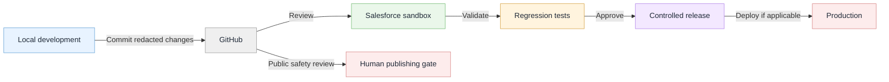

# Deployment Flow

```mermaid
flowchart LR
    A[Local development] -->|"Commit redacted changes"| B[GitHub]
    B -->|"Review"| C[Salesforce sandbox]
    C -->|"Validate"| D[Regression tests]
    D -->|"Approve"| E[Controlled release]
    E -->|"Deploy if applicable"| F[Production]
    B -->|"Public safety review"| G[Human publishing gate]

    style A fill:#E8F3FF,stroke:#6AA6D8,color:#1F2937
    style B fill:#EFEFEF,stroke:#A0A0A0,color:#1F2937
    style C fill:#EAF7EA,stroke:#7CBF7C,color:#1F2937
    style D fill:#FFF4DE,stroke:#D8A84F,color:#1F2937
    style E fill:#F3E8FF,stroke:#B58BEA,color:#1F2937
    style F fill:#FDECEC,stroke:#D98C8C,color:#1F2937
    style G fill:#FDECEC,stroke:#D98C8C,color:#1F2937
```

Gearset should only be added to this diagram if the private implementation actually used Gearset for promotion.