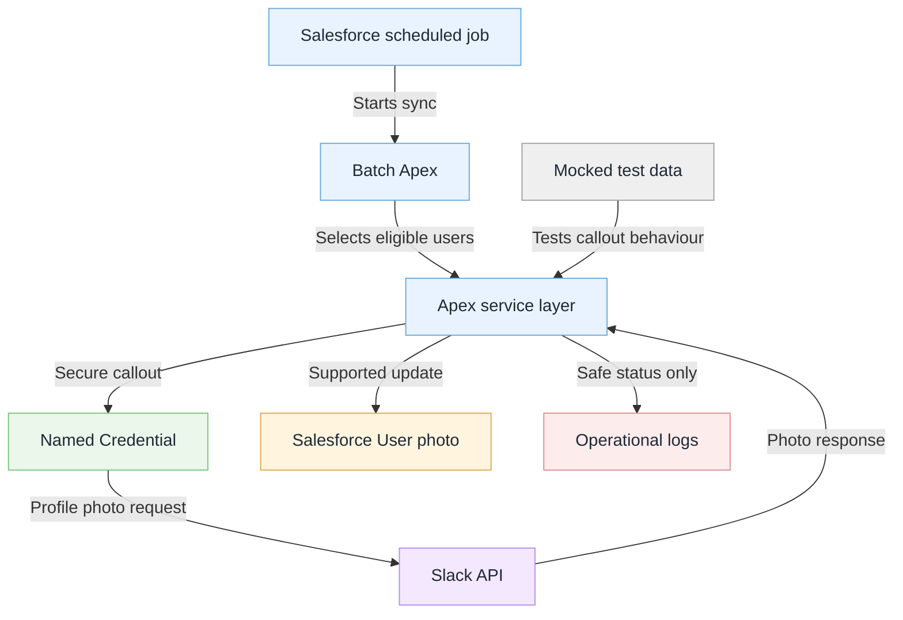

# High-Level Architecture

```mermaid
flowchart TD
    A[Salesforce scheduled job] -->|"Starts sync"| B[Batch Apex]
    B -->|"Selects eligible users"| C[Apex service layer]
    C -->|"Secure callout"| D[Named Credential]
    D -->|"Profile photo request"| E[Slack API]
    E -->|"Photo response"| C
    C -->|"Supported update"| F[Salesforce User photo]
    C -->|"Safe status only"| G[Operational logs]
    H[Mocked test data] -->|"Tests callout behaviour"| C

    style A fill:#E8F3FF,stroke:#6AA6D8,color:#1F2937
    style B fill:#E8F3FF,stroke:#6AA6D8,color:#1F2937
    style C fill:#E8F3FF,stroke:#6AA6D8,color:#1F2937
    style D fill:#EAF7EA,stroke:#7CBF7C,color:#1F2937
    style E fill:#F3E8FF,stroke:#B58BEA,color:#1F2937
    style F fill:#FFF4DE,stroke:#D8A84F,color:#1F2937
    style G fill:#FDECEC,stroke:#D98C8C,color:#1F2937
    style H fill:#EFEFEF,stroke:#A0A0A0,color:#1F2937
```

No real org names, workspace identifiers, internal URLs, credentials, usernames, email addresses or exact matching rules are included.