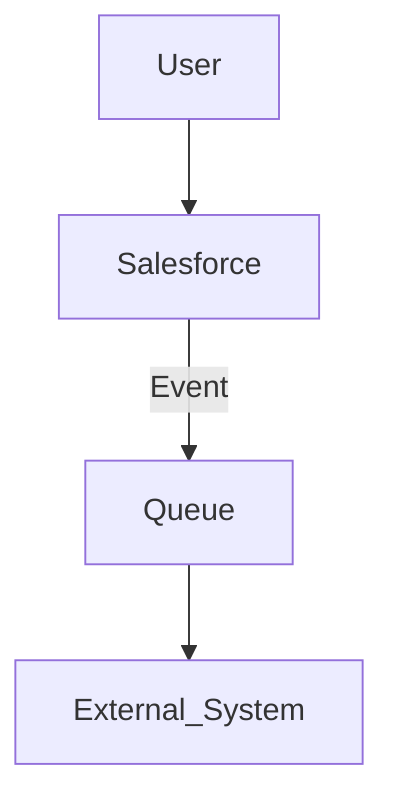

# Project Purpose

Synchronise Salesforce user profile photos from Slack to keep identities consistent for internal users.

# Reason for Starting

Reduce manual administration and eliminate stale images by moving ownership in house. Target outcomes: higher photo coverage for active users and faster correction of mismatches.

# Technologies Used

Salesforce, Slack, Gearset

---

## Context and interaction narrative

The service reads each mapped user’s avatar from Slack and applies it to the Salesforce user profile using supported platform APIs. It can run on demand for a single user or as a scheduled batch across active users. All examples are portfolio‑safe and redacted.

## Component flow

* **User**: administrator or scheduler initiates the sync.
* **Salesforce**: Apex service coordinates callouts and applies photos with ConnectApi.
* **Queue**: batch execution provides scale, retries, and predictable throughput.
* **External\_System**: Slack Web API provides avatar metadata and image bytes.

## Key decisions actually used

* **Apex service + batch** for controllable callouts, retries, and logging.
* **Named Credential** boundary (`NC_[SERVICE]_JWT`) for outbound auth; nothing hard‑coded.
* **ConnectApi** to set photos via supported platform API.
* **Gearset** pipeline for traceable promotion, approvals, and rollback.

## Risks and mitigations

* **Rate limits** → batch sizing and exponential back‑off on HTTP 429.
* **Credential expiry** → rotate in admin configuration; no secrets in code.
* **Image constraints** → choose appropriate Slack variant; validate content type before apply.
* **Partial failures** → capture per‑user errors; targeted reruns only.

## Operations model (summary)

* **Logging**: capture processed/succeeded/failed counts in execution logs.
* **Monitoring**: review logs after each scheduled run.
* **Rollback**: revert via Gearset; optionally reapply prior photo source.
* **Change control**: peer‑reviewed PRs with evidence attached.

## IP notice

Case study. Redacted. No redistribution.
