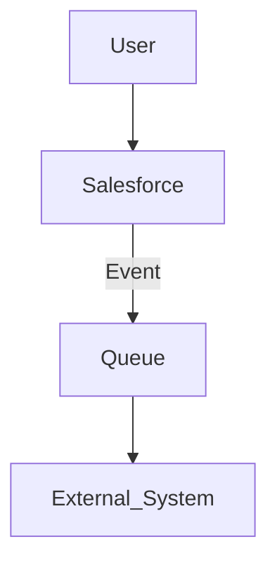

# Project Purpose

Synchronise Salesforce user profile photos from Slack to keep identities consistent for internal users.

# Reason for Starting

Reduce manual admin and eliminate stale images by moving ownership in-house. Success is higher photo coverage for active users and faster correction of mismatches.

# Technologies Used

Salesforce, Slack, Gearset

---

## Context and interaction narrative

The service reads each mapped user’s avatar from Slack and sets the Salesforce profile photo using platform APIs. It runs on demand for a single user or as a batch across active users. Operations and governance follow standard promotion paths and change control.

## Component flow

* **User**: admin or scheduler initiates a sync.
* **Salesforce**: Apex service coordinates calls and applies photos.
* **Queue**: batch execution with retries and backoff.
* **External\_System**: Slack Web API provides avatar metadata and image bytes.

## Key decisions

* **Apex service + batch** chosen over Flow to manage callouts, retries, and logging in a controlled, testable way.
* **Named Credential** boundary for Slack access; no secrets in code; least privilege scopes.
* **ConnectApi** used to set photos via a supported platform API.
* **Gearset** for versioned deployments with review evidence and quick rollback.

## Risks and mitigations

* **Rate limits**: tune batch size; implement backoff on HTTP 429.
* **Auth rotation**: keep tokens out of code; rotate in the Named Credential.
* **Image constraints**: choose an appropriate Slack image variant; validate content type before apply.
* **Partial failures**: per-user error capture; rerun affected users without replaying successes.

## Operations model

* **Logging**: execution summaries and error messages captured in platform logs.
* **Monitoring**: review batch results as part of the runbook.
* **Rollback**: revert via Gearset or reapply prior photos if needed.
* **Change control**: promotion through environments with peer review and recorded evidence.
